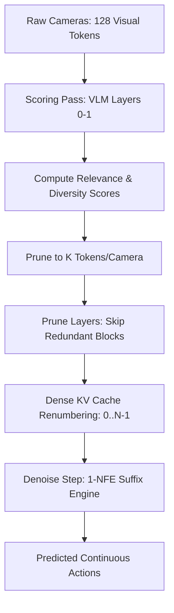

# Implementation Plan: EfficientVLA for RECAP/SnapFlow Policy

This document outlines a production-ready, training-free acceleration plan for our `SmolVLARECAP` policy based on the paper **"EfficientVLA: Training-Free Acceleration and Compression for VLA Models"** (arXiv:2506.10100). The goal is to achieve $\geq 1.5\times$ inference speedup on top of our existing 1-NFE SnapFlow distillation pipeline, while maintaining closed-loop success within $2\%$ of the unpruned baseline.



---

## 1. Architecture Design & System Invariants

To adapt the CogACT-based paper to our SmolVLM2 + RECAP/SnapFlow stack, we must enforce strict software engineering and TensorRT (TRT) constraints:
1. **Paired Skip Execution (C1):** VLM layers and action expert layers are interleaved. Skips must remove paired (VLM, expert) layers to preserve cross-attention connectivity.
2. **Dense KV Cache Renumbering:** TRT exports cannot tolerate holes in `past_key_values` dictionary keys. Survivors must be reindexed to $0 \dots N-1$.
3. **CFG Consistency (C2):** Token pruning must select identical tokens for conditioned and unconditioned batch elements to prevent guidance corruption.
4. **No Denoise Caching (C3):** Explicitly out-of-scope. SnapFlow reduces NFE to 1, rendering step-to-step caching obsolete and TRT-hostile.
5. **In-Graph Token Pruning for TRT:** C2 scoring, TopK, and Gather must live in-graph inside the prefix wrapper to compile cleanly to a static ONNX layout.

---

## 2. Component Implementation Details

### 2.1 Component 1: Paired Layer Pruning (C1)

We will implement config-driven layer pruning by adding `pruned_layers` to `SmolVLARECAPConfig` and dynamically monkeypatching the execution loop of `SmolVLMWithExpertModel` at initialization.

#### Configuration Schema (`src/lerobot_policy_smolvla_rl/configuration_smolvla_recap.py`)
```python
pruned_layers: list[int] | None = None  # Paired layers to skip, e.g., [5, 9, 12]
```

#### Policy-to-Wrapper Config Threading
During policy initialization (`SmolVLARECAPPolicy.__init__`), the RECAP config parameters are explicitly copied onto the VLM wrapper instance, and we run verification checks:
```python
# Thread configuration onto the wrapper model
self.model.vlm_with_expert.pruned_layers = config.pruned_layers
self.model.vlm_with_expert.visual_tokens_keep = config.visual_tokens_keep

# Run pruning safety constraint check
check_pruning_constraints(config.pruned_layers, self.model.vlm_with_expert.num_vlm_layers)
```

#### Pruning Validation & Safety Checks
At model instantiation, we validate that the pruning configuration preserves network connectivity:
* **Constraint 1:** Layer 0 and the final layer ($15$ for a 16-layer model) must never be pruned to preserve input embedding and final projection dynamics.
* **Constraint 2:** Every contiguous sequence of kept layers must contain at least one cross-attention layer (odd index, since `self_attn_every_n_layers=2`), ensuring the expert can attend to VLM context.

```python
def check_pruning_constraints(pruned_layers: list[int] | None, num_layers: int, self_attn_every_n_layers: int = 2):
    if not pruned_layers:
        return
    if any(l < 0 or l >= num_layers for l in pruned_layers):
        raise ValueError(f"Pruned layer indices must be in range [0, {num_layers - 1}].")
    if 0 in pruned_layers or (num_layers - 1) in pruned_layers:
        raise ValueError("Cannot prune the first (0) or final layer.")
        
    kept_layers = [i for i in range(num_layers) if i not in pruned_layers]
    
    # Identify contiguous segments
    segments = []
    current_segment = [kept_layers[0]]
    for x in kept_layers[1:]:
        if x == current_segment[-1] + 1:
            current_segment.append(x)
        else:
            segments.append(current_segment)
            current_segment = [x]
    segments.append(current_segment)
    
    # Validate cross-attention presence in each segment
    for seg in segments:
        has_cross_attn = any(idx % self_attn_every_n_layers != 0 for idx in seg)
        if not has_cross_attn:
            raise ValueError(f"Contiguous kept layer segment {seg} lacks a cross-attention block.")
```

#### Compose Layer-Skip with KI-Patch and Dense KV Re-indexing
To resolve weight lookup and cache indexing roles without altering downstream signatures, we maintain a translation map `self._layer_idx_to_cache_idx` on the wrapper model. We wrap the attention functions, capturing the `model_wrapper` instance in a closure scope to prevent descriptor binding failures:

```python
def make_kv_reindex_wrapper(model_wrapper, original_attn_fn):
    def wrapped_attn_fn(
        model_layers,
        inputs_embeds,
        layer_idx,
        position_ids,
        attention_mask,
        batch_size,
        head_dim,
        use_cache=True,
        fill_kv_cache=True,
        past_key_values=None,
        **kwargs
    ):
        # Translate layer_idx to cache_idx for past_key_values dictionary operations
        cache_idx = layer_idx
        if getattr(model_wrapper, "_layer_idx_to_cache_idx", None) is not None:
            cache_idx = model_wrapper._layer_idx_to_cache_idx.get(layer_idx, layer_idx)

        # Map cache_idx to layer_idx key internally for past_key_values lookup
        mapped_kv = None
        if past_key_values is not None:
            mapped_kv = {}
            if cache_idx in past_key_values:
                mapped_kv[layer_idx] = past_key_values[cache_idx]

        # Call original function (KI patch or original class implementation)
        outputs, updated_kv = original_attn_fn(
            model_layers,
            inputs_embeds,
            layer_idx,  # passed unchanged for weights lookup
            position_ids,
            attention_mask,
            batch_size,
            head_dim,
            use_cache=use_cache,
            fill_kv_cache=fill_kv_cache,
            past_key_values=mapped_kv,
            **kwargs
        )

        # Write back changes from layer_idx key to cache_idx key
        if use_cache and past_key_values is not None and updated_kv is not None:
            if layer_idx in updated_kv:
                past_key_values[cache_idx] = updated_kv[layer_idx]

        return outputs, past_key_values
    return wrapped_attn_fn
```

#### Patch Initialization Order
The KV-reindexing wrappers must be applied **after** the KI patch in `_apply_ki_patch` runs. This ensures the KV-reindexing wraps the `ki_forward_attn_layer` rather than being clobbered by it:
1. `self._apply_ki_patch()`
2. Wrap `forward_attn_layer` and `forward_cross_attn_layer` using `make_kv_reindex_wrapper(self.vlm_with_expert, ...)`.

#### Patched Forward Loop (`src/lerobot_policy_smolvla_rl/efficient_inference.py`)
This patched forward replaces the bypassed decoder layer forward loop entirely, preserving all o_proj, layernorm, MLP, and residual connections.

```python
import torch

def patched_forward(
    self,
    attention_mask: torch.Tensor | None = None,
    position_ids: torch.LongTensor | None = None,
    past_key_values: list[torch.FloatTensor] | None = None,
    inputs_embeds: list[torch.FloatTensor] = None,
    use_cache: bool | None = None,
    fill_kv_cache: bool | None = None,
    limit_layers: int | None = None,
):
    pruned_layers = getattr(self, "pruned_layers", None) or []
    
    # Under C2 scoring (limit_layers is specified), we bypass pruning to protect layer 0 & 1
    if limit_layers is not None:
        kept_layers = list(range(self.num_vlm_layers))[:limit_layers]
        self._layer_idx_to_cache_idx = None
    else:
        kept_layers = [i for i in range(self.num_vlm_layers) if i not in pruned_layers]
        self._layer_idx_to_cache_idx = {layer_idx: cache_idx for cache_idx, layer_idx in enumerate(kept_layers)}
        
    models = [self.get_vlm_model().text_model, self.lm_expert]
    model_layers = self.get_model_layers(models)
    
    for hidden_states in inputs_embeds:
        if hidden_states is not None:
            batch_size = hidden_states.shape[0]

    head_dim = self.vlm.config.text_config.head_dim
    inputs = inputs_embeds
    
    # Ensure cache is initialized to dictionary before the loop if use_cache is enabled
    # to avoid dropping the prefix KV caches.
    if use_cache and past_key_values is None:
        past_key_values = {}
    
    # Execute only the kept layers
    for layer_idx in kept_layers:
        self._current_layer_idx = layer_idx
        
        # Check standard conditions including cross-attention mode
        if (
            fill_kv_cache
            or "cross" not in self.attention_mode
            or (self.self_attn_every_n_layers > 0 and layer_idx % self.self_attn_every_n_layers == 0)
        ):
            att_outputs, past_key_values = self.forward_attn_layer(
                model_layers, inputs, layer_idx, position_ids, attention_mask,
                batch_size, head_dim, use_cache=use_cache, fill_kv_cache=fill_kv_cache, past_key_values=past_key_values
            )
        else:
            att_outputs, past_key_values = self.forward_cross_attn_layer(
                model_layers, inputs, layer_idx, position_ids, attention_mask,
                batch_size, head_dim, use_cache=use_cache, fill_kv_cache=fill_kv_cache, past_key_values=past_key_values
            )
            
        # Per-layer execution of projection, layernorms, MLPs and residual connections
        outputs_embeds = []
        start = 0
        for i, hidden_states in enumerate(inputs):
            layer = model_layers[i][layer_idx]
            att_output = att_outputs[i] if i < len(att_outputs) else att_outputs[0]
            if hidden_states is not None:
                if layer is None:
                    outputs_embeds.append(hidden_states)
                    continue
                end = start + hidden_states.shape[1]

                if att_output.dtype != layer.self_attn.o_proj.weight.dtype:
                    att_output = att_output.to(layer.self_attn.o_proj.weight.dtype)
                att_out = att_output[:, start:end]
                out_emb = layer.self_attn.o_proj(att_out)

                out_emb += hidden_states
                after_first_residual = out_emb.clone()

                out_emb = layer.post_attention_layernorm(out_emb)
                out_emb = layer.mlp(out_emb)

                out_emb += after_first_residual

                outputs_embeds.append(out_emb)
                start = end if len(att_outputs) == 1 else 0
            else:
                outputs_embeds.append(None)
                
        inputs = outputs_embeds

    # Final LayerNorm
    outputs_embeds = []
    for i, hidden_states in enumerate(inputs):
        if hidden_states is not None:
            out_emb = models[i].norm(hidden_states)
            outputs_embeds.append(out_emb)
        else:
            outputs_embeds.append(None)
            
    return outputs_embeds, past_key_values
```

---

### 2.2 Component 2: Task-Aware Visual Token Pruning (C2)

Pruning visual tokens from $64$ to $K$ per camera occurs dynamically in the prefix embedding step.

#### Configuration Schema (`src/lerobot_policy_smolvla_rl/configuration_smolvla_recap.py`)
```python
visual_tokens_keep: int | None = None   # K per camera (e.g., 24); None = Off
token_prune_alpha: float = 0.5          # Split between relevance and diversity
token_prune_k_key: int = 4              # Minimum core key tokens
token_prune_refresh: int = 1            # Amortization step interval (online only)
```

#### Attention Capture Mechanism
To extract relevance metrics $r_i$, we require standard eager attention. We wrap the forward pass inside the context of `AttentionRecorder` (`src/lerobot_policy_smolvla_rl/analyze/attribution/attention.py`). In `SmolVLMWithExpertModel`, the function `get_attention_interface` directly returns `self.eager_attention_forward`. Therefore, we hook `eager_attention_forward` directly without modifying any attention modes:

```python
# In AttentionRecorder context manager
def custom_attention_forward(attention_mask, batch_size, head_dim, query_states, key_states, value_states):
    # Standard softmax and probabilities calculations ...
    probs = nn.functional.softmax(masked_att_weights, dim=-1)
    
    # Capture attention probabilities for the scoring layer (layer 1)
    if getattr(vlm_model, "_record_attention", False) and getattr(vlm_model, "_current_layer_idx", -1) == 1:
        vlm_model._recorded_attention_probs = probs.detach().cpu()
        
    # Return output projection ...
```

#### Executing the Scoring & Token Selection Pass
1. **First-2-Layers scoring:** Call `vlm_with_expert.forward(..., limit_layers=2)` on full prefix.
   > [!IMPORTANT]
   > The C2 scoring pass must run with `use_cache=False` (or a throwaway cache) to prevent writing layer-0/1 KV entries into the main persistent cache under different indices, which would corrupt later prefix updates.
2. **Relevance $r_i$ computation:** Identify the language indices range and camera-specific visual indices from `PrefixLayout`. Slice the recorded attention matrix:
   `attn_lang_to_vision = probs[:, :, lang_indices, visual_indices]`
   Compute $r_i = \text{mean}_{q \in \text{lang}, h \in \text{heads}} (A_{h,q,i})$ for each visual token $i \in [0, 63]$.
3. **Three-Stage selection:**
   * Select top $K_{relevance} = K_{key} + \lfloor \alpha \cdot (K_{keep} - K_{key}) \rfloor$ tokens by relevance.
   * Greedily select the remaining $K_{div}$ tokens to maximize diversity relative to already selected tokens using cosine similarity:
     $$d_j = 1 - \max_{k \in S} \text{cos\_sim}(v_j, v_k)$$
   * Sort the selected indices to preserve spatial layout order.

#### CFG Batch-Duplication Safety Check
During Classifier-Free Guidance (batch size $2B$ via `[uncond, cond]`), token selection runs on the **conditioned half only** ($B$ elements). The resulting indices are repeated for the unconditioned half to guarantee matched layout inputs.

#### `prefix_length` & Dynamic Padding
To achieve actual compute savings, the policy must set `self.prefix_length` to the pruned prefix size:
$$\text{pruned\_length} = \sum_{\text{cameras}} (K + \text{special\_tokens}) + \text{lang\_length} + \text{state\_length}$$
If `prefix_length` is not updated, the pruned sequence is padded back to the baseline length, yielding zero FLOP reductions.

---

### 2.3 Component 3: Offline Layer Redundancy CLI (`src/lerobot_policy_smolvla_rl/analyze/layer_redundancy.py`)

We create an offline tool to determine layer importance before selecting `pruned_layers`.

#### CLI Command
```bash
analyze layer-redundancy --checkpoint <checkpoint_path> --dataset-repo-id <dataset_name>
```

#### Metrics
1. Record layer inputs $hidden\_in$ and outputs $hidden\_out$ over a calibration dataset ($\geq 256$ frames).
2. Compute cosine similarity $C_\ell = \text{mean}_{b, s} (\text{cos\_sim}(hidden\_in, hidden\_out))$ separately for VLM and Expert streams.
3. Compute layer redundancy $R_\ell = \text{normalize}(C_\ell)$ to $[0, 1]$ across layers.
4. Combined redundancy $R_{comb}(\ell) = \min(R_{vlm}(\ell), R_{exp}(\ell))$ (a layer is only redundant if it is redundant in *both* streams).
5. Output: Print a ranked table sorted by descending $R_{comb}$ (highest redundancy first).

---

## 3. Training & Validation Guardrails

To prevent silent training failures and ensure safety:
* **Training Block:** Pruned configurations are strictly prohibited for training. We insert a assertion check at the entrypoints of `train_recap.py` and `train_snapflow.py`:
  ```python
  if config.pruned_layers is not None or config.visual_tokens_keep is not None:
      raise ValueError("Pruning configuration must be disabled during co-training/distillation.")
  ```
* **Recovery / Phase 2 Finetune:** If layer pruning causes a performance drop during evaluation, we support a short expert-only finetune phase (VLM frozen) with the target skip configuration enabled.

---

## 4. Deployment & TensorRT (TRT) Compatibility

1. **In-Graph C2 Token Pruning:** C2 scoring + TopK + Gather selection belong in the ONNX graph inside `SmolVLAPrefixWrapper.forward` (where TRT compiles it).
2. **Temporal Amortization:** If `token_prune_refresh > 1`, index calculation is split to the host side, requiring a separate preprocessing engine to feed indices.
3. **Re-Export Requirements:** Because our exporter freezes layout shapes (no `dynamic_axes`), every distinct config ($K$, `pruned_layers`) requires a unique build. We must add a timing cache to `build_trt_engine` in `lerobot_ros/trt/exporter.py` to accelerate build iterations.

---

## 5. Test Suite Strategy (`tests/test_efficient_inference.py`)

We implement the following tests:
1. **Three-Stage Selector Test:** Mock a synthetic attention tensor and verify that the output indices have correct sizes, no duplicates, and satisfy the per-camera floor.
2. **CFG Invariant Test:** Assert that selected indices are identical for both halves of a batch in CFG mode.
3. **Constraint Validation Test:** Assert that config validation correctly rejects layer configurations that prune layer 0, the final layer, or leave contiguous runs without cross-attention.
4. **Contiguous KV Index Test:** Under a pruned configuration, assert that `list(past_key_values.keys()) == list(range(len(past_key_values)))` after both the prefix pass and suffix denoise step.
5. **Layer Skip Consistency Test:** Assert that forward outputs with `pruned_layers=[k]` on a toy model are identical to executing a model defined without layer $k$.
6. **PrefixLayout Correctness Test:** Verify that `PrefixLayout` properly shrinks according to the target $K$ visual tokens, and that the spans match the sliced tensors.
7. **KI Gradients Preservation Test:** Assert that under pruned configurations, gradients in the Flow Matching path do not reach VLM weight parameters (validating composition correctness).

---

## 6. Evaluation & Calibration Protocol

We evaluate each configuration systematically using the following ablation axis:

| Configuration Axis | Visual Tokens ($K$) | Pruned Layers ($n$) | Diffusion / Flow matching steps |
|---|---|---|---|
| **Baseline (Unpruned)** | 64 | None | 10 |
| **SnapFlow Base** | 64 | None | 1 |
| **SnapFlow + C2** | $\{16, 24, 32, 48\}$ | None | 1 |
| **SnapFlow + C1** | 64 | Derived via CLI | 1 |
| **SnapFlow + C1 + C2** | Calibration Sweep | Calibration Sweep | 1 |

### Metrics to Record per Cell:
1. **Action-Space Metrics:** Action MSE / per-dim MSE vs. ground truth on the eval set (via `analyze ablate`).
2. **Latency & FLOPs Table:** Wall-clock `select_action` and FLOP counts via `torch.profiler` on target GPU/Jetson.
3. **Closed-Loop Success Rate:** LIBERO suite success rate grid (using `run_array_task.py` and `analyze eval-results` pivot).

---

## 7. Rollout Phases

| Phase | Tasks | Target Gate |
|---|---|---|
| **Phase 1** | Implement C2 token pruning, token selector logic, `layer_redundancy.py` analyzer, and CLI registration. | **Offline action-MSE sweep picks K** from $K \in \{16, 24, 32, 48\}$. |
| **Phase 2** | Implement C1 layer pruning hook, validate constraints, and implement dense KV re-indexing. | Contiguous KV index and KI-patch unit tests pass. |
| **Phase 3** | Run `analyze layer-redundancy` on SnapFlow checkpoint. Select $n$ based on redundancy table & offline MSE sweep. Benchmark wall-clock speedup and LIBERO grid success rates. | Speedup $\geq 1.5\times$, success drop $\leq 2\%$. |
| **Phase 4** | TRT export validation, enable timing cache, compile Jetson engines, verify FP16 max-absolute error vs. PyTorch reference. | Rover validation via `record_eval.py`. |
